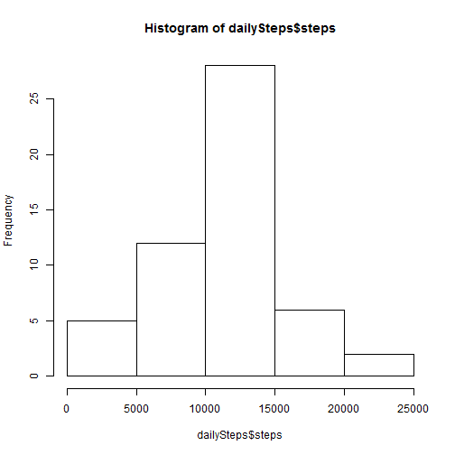
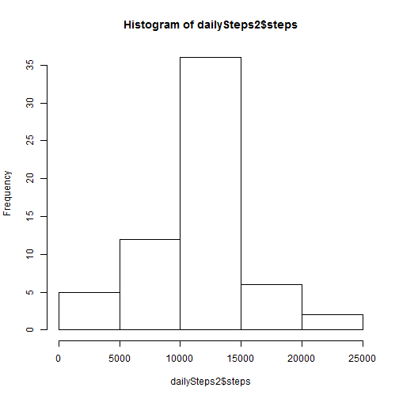
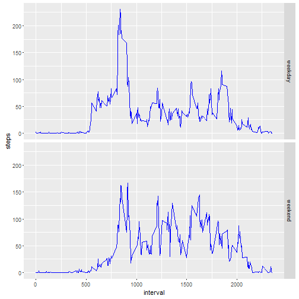

# Reproducible Research: Peer Assessment 1


## Loading and preprocessing the data

```r
# Loading data file
steps<-read.csv("activity.csv")
# Convert date column to date type
steps$date<-as.Date(steps$date)
# Filter out NAs from data
fsteps <- na.omit(steps)
```


## What is mean total number of steps taken per day?

```r
library(ggplot2)
dailySteps<-aggregate(steps ~ date, steps, FUN=sum)
hist(dailySteps$steps)
```



Mean total number of steps taken per day

```r
mean(dailySteps$steps)
```

```
## [1] 10766.19
```
Median total number of steps taken per day

```r
median(dailySteps$steps)
```

```
## [1] 10765
```


## What is the average daily activity pattern?

```r
avgStepsInInterval<-aggregate(steps ~ interval, steps, FUN=mean)
ggplot(avgStepsInInterval, aes(interval, steps)) + geom_line()
```


Which 5-minute interval, on average across all the days in the dataset, contains the maximum number of steps?

```r
avgStepsInInterval[which.max(avgStepsInInterval$steps),]
```

```
##     interval    steps
## 104      835 206.1698
```


## Imputing missing values
There are a number of days/intervals where there are missing values (coded as NA). The presence of missing days may introduce bias into some calculations or summaries of the data.

Total number of missing values in the dataset (i.e. the total number of rows with NAs):

```r
nrow(steps) - nrow(fsteps)
```

```
## [1] 2304
```
To replace the missing values of the orioginal dataset I choose to use the mean of the actual time interval.

```r
for(row in 1:nrow(steps)) {
  if(is.na(steps$steps[row])) {
    steps$steps[row]<-avgStepsInInterval[avgStepsInInterval$interval==steps$interval[row],]$steps
  }
}
```
Histogram after replacement:

```r
dailySteps2<-aggregate(steps ~ date, steps, FUN=sum)
hist(dailySteps2$steps)
```



Comparing mean and median before and after imputing:

Mean change:

```r
mean(dailySteps$steps)
```

```
## [1] 10766.19
```

```r
mean(dailySteps2$steps)
```

```
## [1] 10766.19
```
Median change:

```r
median(dailySteps$steps)
```

```
## [1] 10765
```

```r
median(dailySteps2$steps)
```

```
## [1] 10766.19
```


## Are there differences in activity patterns between weekdays and weekends?

```r
steps$dayType<-weekdays(steps$date)
steps$dayType<-sapply(steps$dayType, function(x) if(x=="Sunday" | x=="Saturday") "weekend" else "weekday")
dailyStepsDayType <- aggregate(steps ~ interval + dayType, steps, FUN=mean)
ggplot(dailyStepsDayType, aes(interval, steps)) + geom_line(colour="blue") + facet_grid(dayType ~ .)
```



There are differences between weekday and weekend activities.
